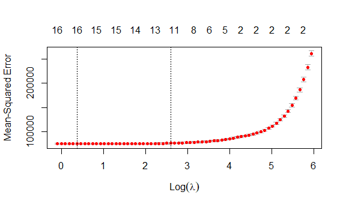
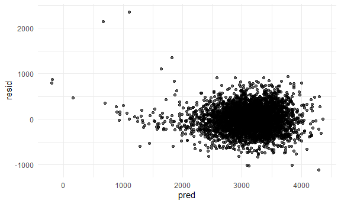
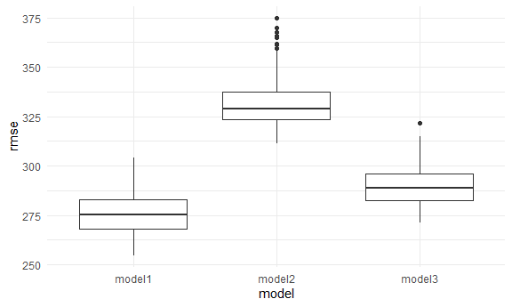

p8105_hw6_zl3119
================
Zheyan
11/24/2021

# Problem 1

In this problem, you will analyze data gathered to understand the
effects of several variables on a child’s birthweight. This dataset,
available here, consists of roughly 4000 children and includes the
following variables:

## Load and clean the data for regression analysis

``` r
birthweight_df = 
  read_csv('data/birthweight.csv', show_col_types = FALSE) %>% 
  janitor::clean_names()

# No missing value
colSums(is.na(birthweight_df))
```

    ##  babysex    bhead  blength      bwt    delwt  fincome    frace  gaweeks 
    ##        0        0        0        0        0        0        0        0 
    ##  malform menarche  mheight   momage    mrace   parity  pnumlbw  pnumsga 
    ##        0        0        0        0        0        0        0        0 
    ##    ppbmi     ppwt   smoken   wtgain 
    ##        0        0        0        0

``` r
birthweight_df = 
  birthweight_df %>% 
  # change some numeric variables to factors
  mutate(babysex = as.factor(babysex),
         # rename as father_race
         father_race = as.factor(frace),
         malform = as.factor(malform),
         # rename as mother_race
         mother_race = as.factor(mrace),
         if_smoke = as.factor(ifelse(smoken > 0, 1, 0))) %>% 
  select(-frace, -mrace, -smoken)

# show the cleaned data
head(birthweight_df) %>% 
  knitr::kable()
```

| babysex | bhead | blength |  bwt | delwt | fincome | gaweeks | malform | menarche | mheight | momage | parity | pnumlbw | pnumsga |    ppbmi | ppwt | wtgain | father_race | mother_race | if_smoke |
|:--------|------:|--------:|-----:|------:|--------:|--------:|:--------|---------:|--------:|-------:|-------:|--------:|--------:|---------:|-----:|-------:|:------------|:------------|:---------|
| 2       |    34 |      51 | 3629 |   177 |      35 |    39.9 | 0       |       13 |      63 |     36 |      3 |       0 |       0 | 26.27184 |  148 |     29 | 1           | 1           | 0        |
| 1       |    34 |      48 | 3062 |   156 |      65 |    25.9 | 0       |       14 |      65 |     25 |      0 |       0 |       0 | 21.34485 |  128 |     28 | 2           | 2           | 0        |
| 2       |    36 |      50 | 3345 |   148 |      85 |    39.9 | 0       |       12 |      64 |     29 |      0 |       0 |       0 | 23.56517 |  137 |     11 | 1           | 1           | 1        |
| 1       |    34 |      52 | 3062 |   157 |      55 |    40.0 | 0       |       14 |      64 |     18 |      0 |       0 |       0 | 21.84508 |  127 |     30 | 1           | 1           | 1        |
| 2       |    34 |      52 | 3374 |   156 |       5 |    41.6 | 0       |       13 |      66 |     20 |      0 |       0 |       0 | 21.02642 |  130 |     26 | 1           | 1           | 1        |
| 1       |    33 |      52 | 3374 |   129 |      55 |    40.7 | 0       |       12 |      66 |     23 |      0 |       0 |       0 | 18.60030 |  115 |     14 | 1           | 1           | 0        |

There isn’t missing value in the dataframe. Change ‘babysex’,
‘father_race’, ‘malform’, ‘mother_race’ into factor. In addition, change
smoken into an indicator variable ‘if_smoke’ because the average number
of cigarettes smoked per day during pregnancy does not have linear
association with the weight gain of the baby.

## Build model

Propose a regression model for birthweight. This model may be based on a
hypothesized structure for the factors that underly birthweight, on a
data-driven model-building process, or a combination of the two.
Describe your modeling process and show a plot of model residuals
against fitted values.

There are many variables in the dataframe. We should avoid selecting too
much variables to avoid multicollinearity(overfitting). Therefore, I use
Lasso to select variables. Lasso adds L1 regularization in the loss
function and forces the coefficients of some variables towards zero.

First, I dummied all category variables and used 5-fold cross validation
to choose the best lambda (L1 regularization term). I plot the MSE when
lambda is choosing different values.



The best lambda is 13.4334591

Then I used this lambda to build a Lasso regression model (for selection
of variables). The model coefficients are listed below

``` r
lasso_model = glmnet(x, y, alpha = 1, lambda = best_lambda)
coef.apprx = coef(lasso_model, s = 0.5, exact = FALSE)
# coefficients
coef(lasso_model) 
```

    ## 25 x 1 sparse Matrix of class "dgCMatrix"
    ##                          s0
    ## (Intercept)   -5.722949e+03
    ## bhead          1.279663e+02
    ## blength        7.478091e+01
    ## delwt          1.233087e+00
    ## fincome        9.502454e-02
    ## gaweeks        9.572397e+00
    ## menarche       .           
    ## mheight        4.164264e+00
    ## momage         .           
    ## parity         .           
    ## pnumlbw        .           
    ## pnumsga        .           
    ## ppbmi          .           
    ## ppwt           .           
    ## wtgain         1.806477e+00
    ## babysex_2      .           
    ## father_race_2  .           
    ## father_race_3  .           
    ## father_race_4 -1.014090e+01
    ## father_race_8  .           
    ## malform_1      .           
    ## mother_race_2 -9.671084e+01
    ## mother_race_3  .           
    ## mother_race_4 -1.676987e+01
    ## if_smoke_1    -2.563180e+01

Note that the `echo = FALSE` parameter was added to the code chunk to
prevent printing of the R code that generated the plot.

After Lasso selection, there are 12 variables in the model(including
dummy variables and intercept).

Then, I used the selected variables to fit a regression model.

``` r
adf = as.data.frame(as.matrix(coef(lasso_model)))
adf$variable = row.names(adf)

selected_cols = 
  as.tibble(adf)  %>% 
  filter(s0 != 0, variable != "(Intercept)") %>% 
  pull(variable)

x = data.matrix(
      df_dummy %>% 
      select(selected_cols)
)

y = data.matrix(
      df_dummy %>% 
      pull(bwt)
)

linear_model1 = lm(y ~ x)

linear_model1 %>% 
  broom::tidy() %>% 
  knitr::kable()
```

| term           |      estimate |   std.error |  statistic |   p.value |
|:---------------|--------------:|------------:|-----------:|----------:|
| (Intercept)    | -6052.2486852 | 137.4366691 | -44.036637 | 0.0000000 |
| xbhead         |   129.2810998 |   3.4229688 |  37.768706 | 0.0000000 |
| xblength       |    75.2434516 |   2.0265017 |  37.129725 | 0.0000000 |
| xdelwt         |     1.4395016 |   0.2320782 |   6.202657 | 0.0000000 |
| xfincome       |     0.3031029 |   0.1755229 |   1.726857 | 0.0842647 |
| xgaweeks       |    11.6016821 |   1.4575680 |   7.959616 | 0.0000000 |
| xmheight       |     6.5541435 |   1.7925239 |   3.656377 | 0.0002588 |
| xwtgain        |     2.7152248 |   0.4295139 |   6.321622 | 0.0000000 |
| xfather_race_4 |   -47.6012987 |  42.5958738 |  -1.117510 | 0.2638385 |
| xmother_race_2 |  -124.6878478 |   9.6405459 | -12.933692 | 0.0000000 |
| xmother_race_4 |   -43.8161256 |  43.3529658 |  -1.010684 | 0.3122244 |
| xif_smoke_1    |   -57.2710806 |   8.5839025 |  -6.671917 | 0.0000000 |

In th regression model, Birth weight is positively related to
**bhead**(baby’s head circumference at birth), **blength** (baby’s
length at birth), **delwt**(mother’s weight at delivery),
**fincome**(family monthly income) and **mheigth** (mother’s height).
And is negatively related with **if_smoke**(if mother smoked during
pregnancy) and some parents races when compared with white.

Finally, I calculated residuals and make a plot of model residuals
against fitted values

``` r
birthweight_df %>% 
  modelr::add_residuals(linear_model1) %>% 
  modelr::add_predictions(linear_model1) %>% 
  ggplot(aes(x = pred, y = resid)) +
  geom_point(alpha = 0.6)
```



Despite some large outliers when the predication is small, the residual
is random and shows no pattern when predicted value increases.

## Compare my models to two others

-   One using length at birth and gestational age as predictors (main
    effects only)
-   One using head circumference, length, sex, and all interactions
    (including the three-way interaction) between these

Build these two models and do cross validation

``` r
linear_model2 = lm(bwt ~ blength + gaweeks, data = birthweight_df)
linear_model3 = lm(bwt ~ bhead + blength + babysex + bhead*blength + bhead*babysex + blength*babysex + bhead*blength*babysex, data = birthweight_df)

# Create CV dataframe
cv_df = 
  crossv_mc(df_dummy, 100) %>% 
  mutate(
    train = map(train, as_tibble),
    test = map(test, as_tibble)
  )

# Cross validation and note the rmse on each test set
cv_df = 
  cv_df %>% 
  mutate(
    linear_model1 = map(train, ~lm(bwt ~ bhead + blength + delwt + fincome + gaweeks + mheight + wtgain
                                   + father_race_4 + mother_race_2 + mother_race_4 + if_smoke_1, data = .x)),
    linear_model2 = map(train, ~lm(bwt ~ blength + gaweeks, data = .x)),
    linear_model3 = map(train, ~lm(bwt ~ bhead + blength + babysex_2 + bhead*blength + bhead*babysex_2 + blength*babysex_2 + bhead*blength*babysex_2, data = .x))) %>% 
  mutate(
    rmse_model1 = map2_dbl(linear_model1, test, ~rmse(model = .x, data = .y)),
    rmse_model2 = map2_dbl(linear_model2, test, ~rmse(model = .x, data = .y)),
    rmse_model3 = map2_dbl(linear_model3, test, ~rmse(model = .x, data = .y)))
```

Look at the output

``` r
cv_df %>% 
  select(starts_with('rmse')) %>% 
  pivot_longer(
    rmse_model1:rmse_model3,
    names_to = 'model',
    values_to = 'rmse', 
    names_prefix = 'rmse_'
  ) %>% 
  ggplot(aes(x = model, y = rmse)) +
  geom_boxplot()
```



Based on cross validation, the prediction error of model 1 is lowest and
model2 is highest. Note that model 1 can still be improved if L1
regularzation is included.

# Problem 2

Read data

``` r
weather_df = 
  rnoaa::meteo_pull_monitors(
    c("USW00094728"),
    var = c("PRCP", "TMIN", "TMAX"), 
    date_min = "2017-01-01",
    date_max = "2017-12-31") %>%
  mutate(
    name = recode(id, USW00094728 = "CentralPark_NY"),
    tmin = tmin / 10,
    tmax = tmax / 10) %>%
  select(name, id, everything())
```

    ## Registered S3 method overwritten by 'hoardr':
    ##   method           from
    ##   print.cache_info httr

    ## using cached file: C:\Users\jimmy\AppData\Local/Cache/R/noaa_ghcnd/USW00094728.dly

    ## date created (size, mb): 2021-10-13 19:11:51 (7.62)

    ## file min/max dates: 1869-01-01 / 2021-10-31

Build a model with actual data, a simple linear regression with tmax as
the response and tmin as the predictor

``` r
linear_model = lm(tmax ~ tmin, data = weather_df)

# R2
R2 = 
  linear_model %>% 
    broom::glance() %>% 
    pull(r.squared)

# log(β^0∗β^1)
linear_model_df = 
  linear_model %>% 
  broom::tidy()

beta0 = linear_model_df %>%  filter(term == '(Intercept)') %>%  pull(estimate)
beta1 = linear_model_df %>%  filter(term == 'tmin') %>%  pull(estimate)
logbeta = log(beta0 * beta1)

print(R2)
```

    ## [1] 0.9115425

``` r
print(logbeta)
```

    ## [1] 2.013752

Bootstrap 5000 samples and get each R2 and logbeta

``` r
weather_samples = 
  weather_df %>% 
    modelr::bootstrap(n = 5000) %>% 
    mutate(
      models = map(strap, ~ lm(tmax ~ tmin, data = .x)),
      estimates = map(models, broom::tidy),
      glance = map(models, broom::glance))


weather_samples_info = 
  weather_samples %>% 
    unnest(glance, estimates) %>% 
    select(.id, term, estimate, r.squared) %>% 
    # bracket can cause error
    mutate(term = ifelse(term == '(Intercept)', 'beta0', 'beta1')) %>% 
    pivot_wider(names_from = term, 
                values_from = estimate) %>% 
    mutate(
      logbeta = log(beta0 * beta1)
    )
```

Identify the 2.5% and 97.5% quantiles to provide a 95% confidence
interval

``` r
get_quantiles = function(df, col, percent){
  print(paste(col, paste(100*(1-2*percent),'%',sep = ''), 'CI'))
  quantile(df %>% pull(col), c(percent, 1-percent))
}

sign_level = 0.05

# R2
get_quantiles(weather_samples_info, 'r.squared', sign_level/2)
```

    ## [1] "r.squared 95% CI"

    ##      2.5%     97.5% 
    ## 0.8938161 0.9274290

``` r
# log(β^0∗β^1)
get_quantiles(weather_samples_info, 'logbeta', sign_level/2)
```

    ## [1] "logbeta 95% CI"

    ##     2.5%    97.5% 
    ## 1.965749 2.057587

The actual R2 (0.9115425) and log(β<sup>0∗β</sup>1) (2.0137519) are both
in the 95% CI
